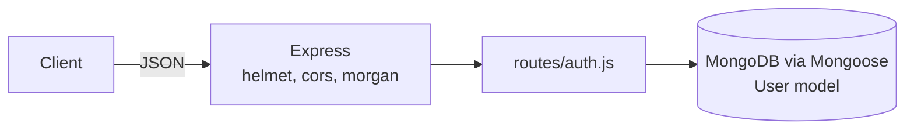

# Tailor Backend

A small Express + MongoDB authentication API written for a tailoring-shop app: user registration, login and password reset. Learning project.

## Status

Learning project, early stage. Only the auth routes exist. A Vercel deployment exists, but at the time of writing its database-backed endpoints time out (the root route still answers), so no live demo is listed. No frontend is included in this repository.

## Features (from the code)

- Register a user (`name`, `email`, `password`, `contact`). Passwords are hashed with bcrypt, and users get the role `User` by default.
- Login checks credentials and returns the user document. No token or session is issued.
- Password reset sets a new password for an email address, with no verification step.

## Architecture



## Tech stack

Node.js (ES modules), Express 4, Mongoose 8, bcrypt, helmet, cors, morgan, dotenv. Deployed with `vercel.json` using `@vercel/node`.

## Getting started

```bash
npm install
cp .env.example .env   # fill in MONGODB_URI
npm start              # nodemon index.js
```

## Environment variables

| Name | Purpose |
|------|---------|
| `PORT` | Port the server listens on |
| `MONGODB_URI` | MongoDB connection string |

## API reference

| Method | Path | Auth | Purpose |
|--------|------|------|---------|
| GET | `/` | none | Health text ("welcome") |
| POST | `/api/auth/register` | none | Create a user |
| POST | `/api/auth/login` | none | Check credentials and return the user |
| POST | `/api/auth/forgot-password` | none | Set a new password for an email |

## Known limitations

- No JWT or session handling, so there are no protected routes.
- `register` never responds if it fails, and `forgot-password` returns status 300 on errors.
- No tests.
